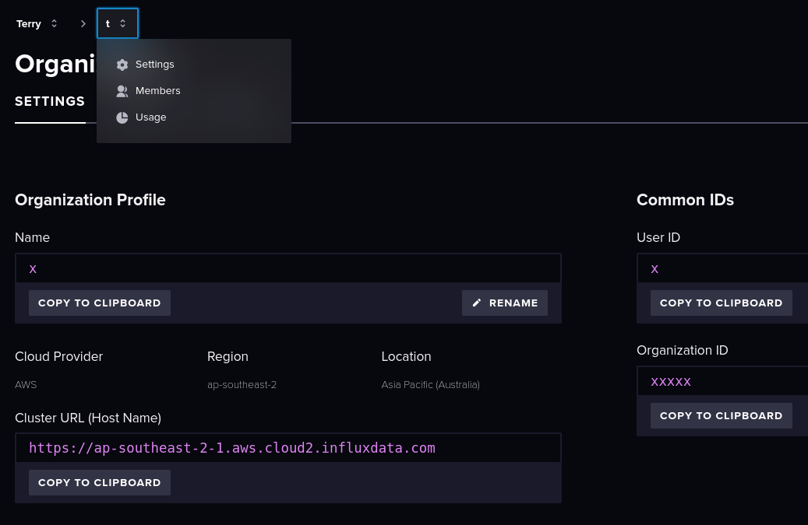
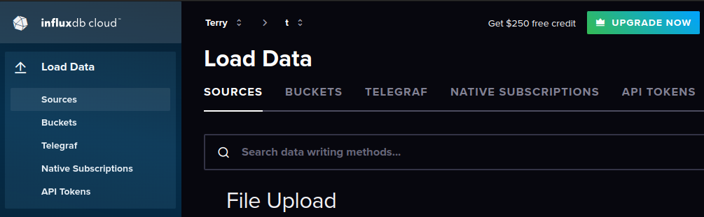
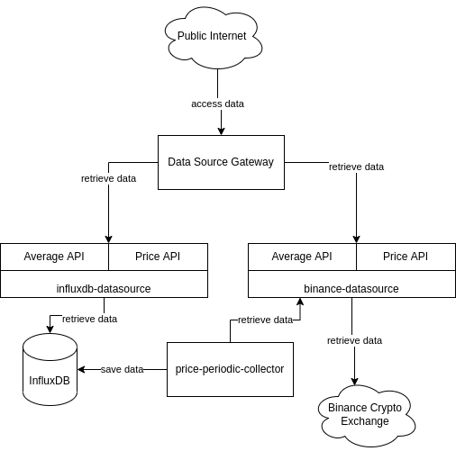

# Crypto Price Retrieval Task

## Quick Start

### Prerequisite Tools
git, docker, go (version 1.18)

### Sign Up And Setup InfluxDB Cloud
Sign up page: https://cloud2.influxdata.com/signup  
After sign up, go to the dashboard:
- copy the Organization ID , Cluster Url(server url)

- create the bucket named:
  - crypto
  - crypto_test
    
- generate and copy the API Token

### Setup Environment
- Install dependencies
  - `go mod download`
- Copy `set-env.sh` to `set-local-env.sh`
  - this is local environment file for the local development and local execute the program
- Copy `docker-compose-example.env` to `docker-compose.env`
  - this is docker-compose environment file for up and run in the docker
- Fill in the influxDB info that retrieved in the last step to the `set-local-env.sh` and `docker-compose.env`

### Build and Run
#### Build the docker images and run the system in docker
```
make build-n-up
```

### Retrieve Price Data via Datasource Gateway HTTP APIs
open browser and enter the urls:
- price: `http://127.0.0.1:9901api/v1/price?ts=1667457091`
- average: `http://127.0.0.1:9901/api/v1/average?&from=1569484800&until=1569492000&granularity=1s`  
<sup>The ports is defined in docker-compose.yaml</sup>

## Commands
`make build-n-up`: build the docker images and run the system via docker-compose  
`make up`: docker-compose up  
`make build-bin`: build binaries  
`make build-image`: build docker images  
`make go-test`: go test

## High Level System Architecture


## Components
- datasource: access data from different source (e.g. database, crypto exchange)
  - `binance-datasource`: access data from Binance crypto exchange
  - `influxdb-datasource`: access data from the influxDB database, only support 1 minute granularity
- datasource gateway: access data from multiple data source via HTTP API
  - `datasource-gw`: allow user access data from multiple data source via HTTP API.
    Automatic failover to other data source, if default data source is not available
- price periodic collector: collect the data from data source and save the data to the database
    - `price-periodic-collector`: collect the price data to the influxDB per 1 minute

### HTTP APIs
#### datasource gateway
Endpoints:
- /api/v1/price
  - query strings:
    - ts (required): timestamp in unix time format
- /api/v1/average
  - query strings:
      - from (required): from timestamp in unix time format
      - until (required): until timestamp in unix time format
      - granularity (optional): data granularity (available option: 1s,1m,1h,1d,1M)

#### datasource
Endpoints:
- /api/v1/price
    - query strings:
        - ts (required): timestamp in unix time format
- /api/v1/average
    - query strings:
        - from (required): from timestamp in unix time format
        - until (required): until timestamp in unix time format
        - granularity (optional): data granularity (available option: 1s,1m,1h,1d,1M)
